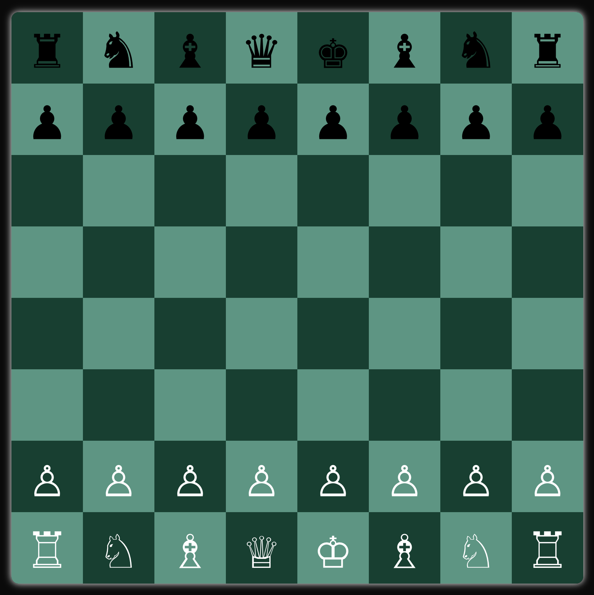

# ♟️ Chess Game – Multiplayer in Next.js

A fully functional Chess game built with **Next.js** and **TypeScript**, featuring:

- Full move validation including check, checkmate, castling, and en passant  
- Multiplayer support via **WebSockets**  
- All game logic handled on the **frontend**  
- Clean and responsive UI with end-game animations

---

## 📸 Preview



## 🚀 Features

- ♜ Valid move generation for all pieces  
- 🧠 Separation of `getPseudoLegalMoves` and `getValidMoves`  
- 🔒 King safety checks and castling logic (with square clearance & threat checks)  
- 🏁 Checkmate and stalemate detection  
- ♻️ Move history tracking  
- ⚡ Fully client-side rule engine  
- 🔌 Real-time multiplayer via Socket.IO *(WIP)*  
- 🎨 Visual effects for end-game  

---

## 🧠 Architecture

```
Frontend:  Next.js + TypeScript  
Game Engine: Custom logic written entirely in TypeScript  
Multiplayer: Socket.IO (backend handles only socket transport)  
State: React Hooks  
```

---

## 📦 Getting Started

```bash
# 1. Clone the repository
git clone git@github.com:vlakhara/chess.git
cd chess

# 2. Install dependencies
npm install

# 3. Run the development server
npm run dev

# App runs at http://localhost:3000
```

---

## 📅 Roadmap

- [x] Complete chess rules  
- [x] En passant & castling  
- [x] Checkmate/stalemate detection  
- [x] Move history  
- [ ] Real-time multiplayer (Socket.IO)  
- [ ] Timed games / Blitz mode  
- [ ] Spectator mode  
- [ ] Mobile responsiveness  
- [ ] Match history & analytics  

---

## 🧑‍💻 Author

**Vipul Lakhara**  
GitHub: [@vlakhara](https://github.com/vlakhara)  
💼 Software Development Engineer | Chess + Code Enthusiast  
💬 Open to collaboration and feedback

---

## 🤝 Contributing

Pull requests are welcome.  
For major changes, open an issue first to discuss what you’d like to change.

---

## 📄 License

**MIT License**  
Free to use and modify. Attribution appreciated but not required.
